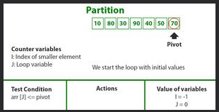
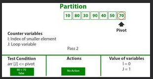
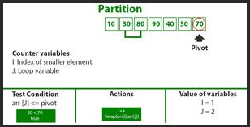
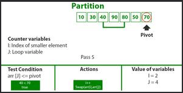
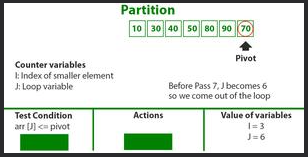
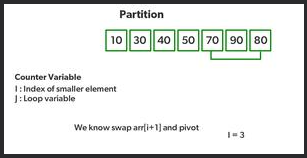
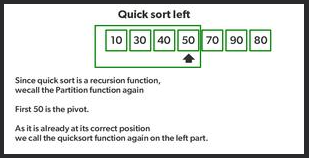
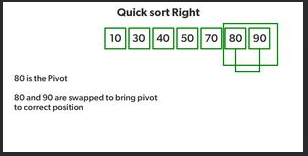

# Challenge Summary
Quick sort follows Divide and Conquer algorithm. It is dividing elements in to smaller parts based on some condition and performing the sort operations on those divided smaller parts. Hence, it works well for large datasets. So, here are the steps how Quick sort works in simple words.

1. First select an element which is to be called as pivot element.

2. Next, compare all array elements with the selected pivot element and arrange them in such a way that, elements less than the pivot element are to it’s left and greater than pivot is to it’s right.

3. Finally, perform the same operations on left and right side elements to the pivot element.

-----

## Code :

```
function swap(arr, i, low) {

  var temp = arr[i];
  arr[i] = arr[low];
  arr[low] = temp;

}

function partition(arr, left, right) {

  let pivot = arr[right];
  let low = left - 1;

  for (let i = left; i < right ; i++){
    if (arr[i] <= pivot) {
      low++;
      swap(arr,i,low);
    }
  }
  swap(arr,right,low + 1);

  return low + 1;

}

function quickSort(arr, left, right) {
  if (arr.length === 1) {
    return arr;
  }

  if (left < right) {
    let position = partition(arr, left, right);
    quickSort(arr, left, position - 1);
    quickSort(arr, position + 1, right);
    return arr;
  }

}
```

-----
## Whiteboard Process

-----
### Trace


Consider: arr[] = {10, 80, 30, 90, 40, 50, 70}

* Indexes: 0 1 2 3 4 5 6

* low = 0, high = 6, pivot = arr[h] = 70

* Initialize index of smaller element, i = -1


* Traverse elements from j = low to high-1

   * j = 0: Since arr[j] <= pivot, do i++ and swap(arr[i], arr[j])
   * i = 0
* arr[] = {10, 80, 30, 90, 40, 50, 70} // No change as i and j are same

* j = 1: Since arr[j] > pivot, do nothing



* j = 2 : Since arr[j] <= pivot, do i++ and swap(arr[i], arr[j])

* i = 1

* arr[] = {10, 30, 80, 90, 40, 50, 70} // We swap 80 and 30



* j = 3 : Since arr[j] > pivot, do nothing // No change in i and arr[]

* j = 4 : Since arr[j] <= pivot, do i++ and swap(arr[i], arr[j])

* i = 2

* arr[] = {10, 30, 40, 90, 80, 50, 70} // 80 and 40 Swapped



* j = 5 : Since arr[j] <= pivot, do i++ and swap arr[i] with arr[j]

* i = 3

* arr[] = {10, 30, 40, 50, 80, 90, 70} // 90 and 50 Swapped



* We come out of loop because j is now equal to high-1.

* Finally we place pivot at correct position by swapping arr[i+1] and arr[high] (or pivot)

* arr[] = {10, 30, 40, 50, 70, 90, 80} // 80 and 70 Swapped



* Now 70 is at its correct place. All elements smaller than 70 are before it and all elements greater than 70 are after it.

* Since quick sort is a recursive function, we call the partition function again at left and right partitions



* Again call function at right part and swap 80 and 90



----

## Approach & Efficiency
I used the Array approach with two for loops

The big O => O(nLogn) time.

The big O => O(n) space.

----

## Examples:

```
let arr = [7,0,-2,8];
    let sortedArr = quickSort(arr,0,arr.length-1);
    console.log(arr);

// output : [-2,0,7,8]

```