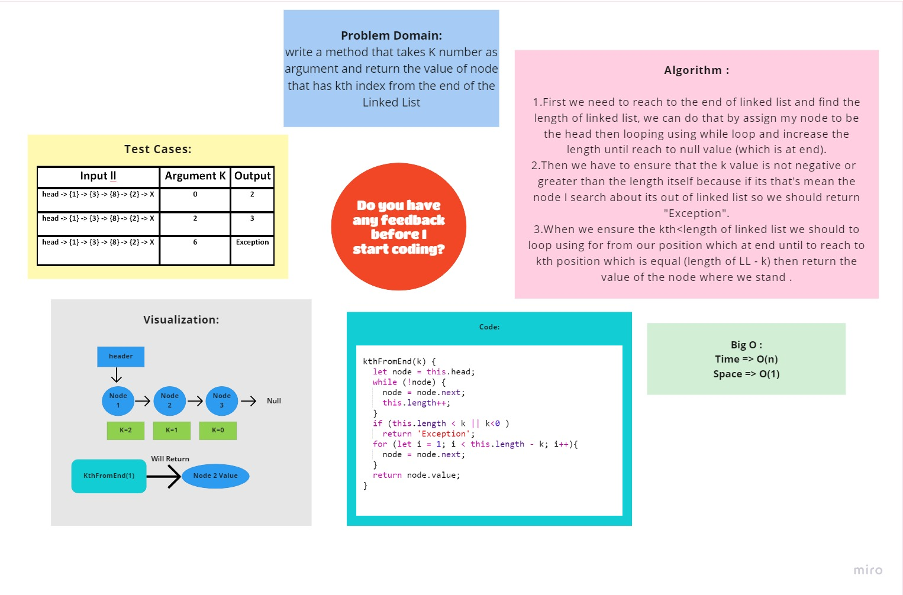

# k-th value from the end of a linked list.

# Whiteboard

# B(O):
The time of this method is O(n) 
the space is O(1).

# Challenge Summary
write a method that takes K number as argument and return the value of node that has kth index from the end of the Linked List