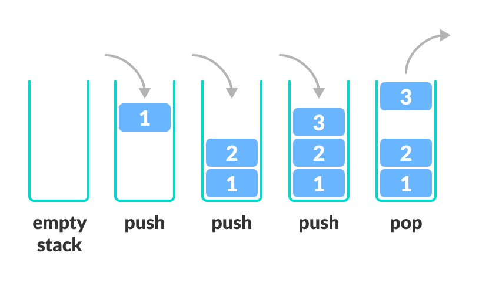

# Stack Data Structure

## Features
Using a Linked List as the underlying data storage mechanism, implement both a Stack

### Node

Create a Node class that has properties for the value stored in the Node, and a pointer to the next node.

### Stack

Create a Stack class that has a top property. It creates an empty Stack when instantiated.

This object should be aware of a default empty value assigned to top when the stack is created.

The class should contain the following methods:

***push***

Arguments: value

adds a new node with that value to the top of the stack with an O(1) Time performance.

***pop***

Arguments: none

Returns: the value from node from the top of the stack

Removes the node from the top of the stack

Should raise exception when called on empty stack

***peek***

Arguments: none

Returns: Value of the node located at the top of the stack

Should raise exception when called on empty stack

***is empty***

Arguments: none

Returns: Boolean indicating whether or not the stack is empty.

## Testing

Write tests to prove the following functionality:

Can successfully push onto a stack
Can successfully push multiple values onto a stack
Can successfully pop off the stack
Can successfully empty a stack after multiple pops
Can successfully peek the next item on the stack
Can successfully instantiate an empty stack
Calling pop or peek on empty stack raises exception

